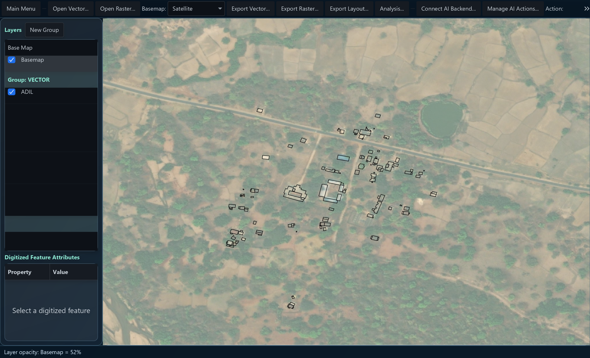
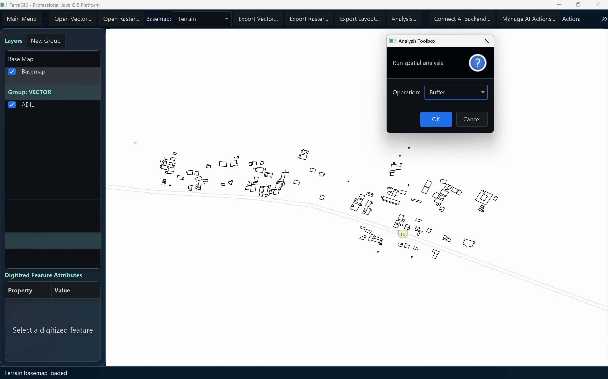

# TerraGIS

TerraGIS is a JavaFX-based GIS application for viewing, editing, and packaging geospatial data.

Website: https://terragis.co.in

## Build

```bash
./mvnw clean package
```

On Windows, use:

```powershell
.\mvnw.cmd clean package
```

## Run

Use the provided launcher scripts for local startup:

- `start-terragis.ps1`
- `Start-TerraGIS.cmd`

## Notes

Generated packaging artifacts and build outputs are excluded from the GitHub branch to keep the repository lightweight.

## Screenshots

The following screenshots are included in the repository and can be viewed directly from the README:




